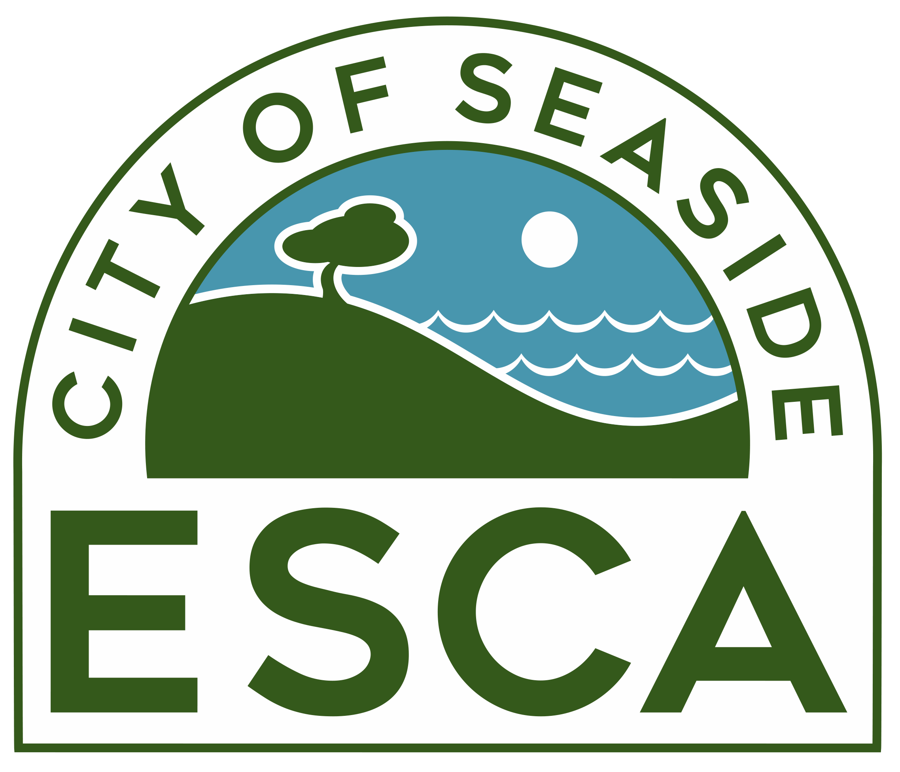

```{r setup, include=FALSE}
knitr::opts_chunk$set(echo = TRUE)
library(fontawesome)
```


This document was developed to support the goals of the ESCA Signage Committee:
  
  - Promoting the health and safety of people on ESCA lands through signage.
  - Developing cohesive standards for planning, designing, fabricating, ordering, installing, and maintaining signs consistently.

</br>  

## Types of Signage Proposed

The four types of signage proposed at the ESCA Signage Committee include:

  &emsp;  &ensp; *Usage Control Signage:* Present acceptable and unacceptable uses at entry points.
  
  &emsp;  &ensp; *Restricted Area Signage:* Notify land users of access restrictions and list applicable municipal code.
  
  &emsp;  &ensp; *Gate Access Signage:* Identify high traffic gates around former Ft. Ord, making it easier for emergency responders to identify their location.
  
  &emsp;  &ensp; *Directional Trail Signage:* Aid users in understanding the trail network and how to best use the land.


<table style = "border: 1px black solid;">
<tr style = "background-color: #f5f5f5;"><td style = "padding: 10px;">
**Note:** *Directional Trail Signage* has not been included in this proposal. Each land owning jurisdiction should determine which trails should or should not be open to the public prior to determining where along each trail signage could go.
</td></tr>
</table>  

</br>   
  
## Disclaimer
  
This document is designed to serve as a visual aid for planners. The views expressed here are not those of the authors, the landowners or any regulatory agency associated with the former Fort Ord. 

```{r, echo = FALSE, out.width = "15%", fig.align='center'}

```

<hr>

<center><small>Proudly made with open source software by [Chris Callaghan](https://github.com/cjcallag), code available on [`r fa('github')`](https://github.com/cjcallag/esca-signage-proposal).</small></center>

